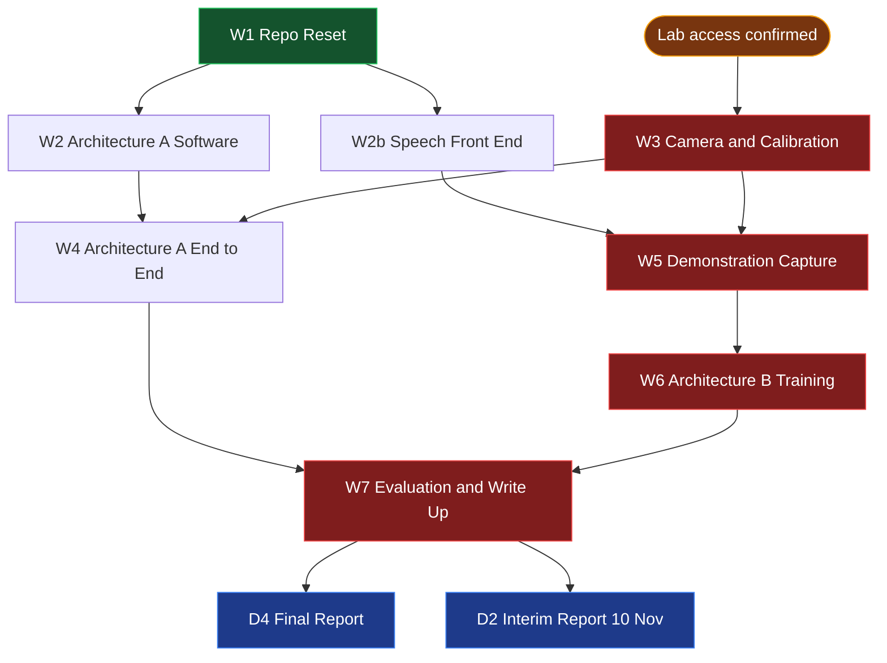
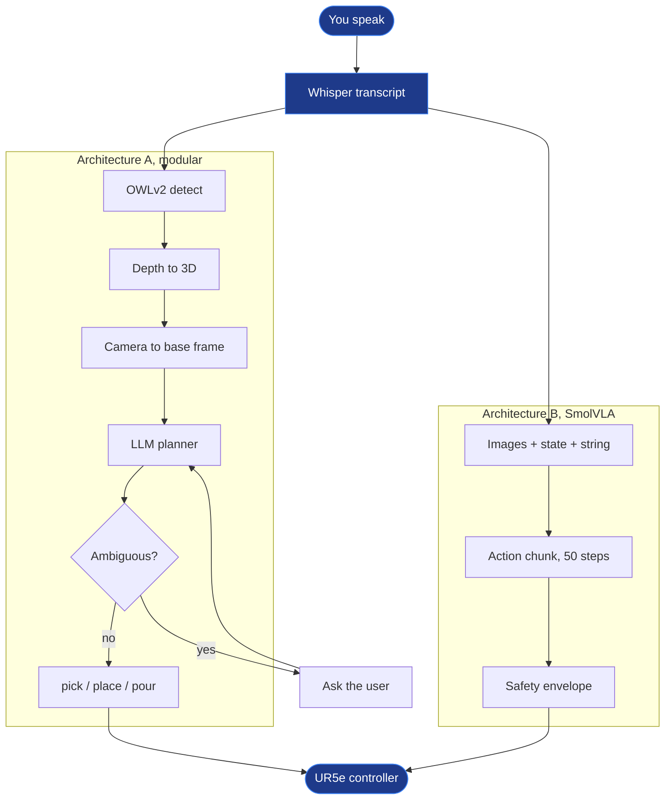
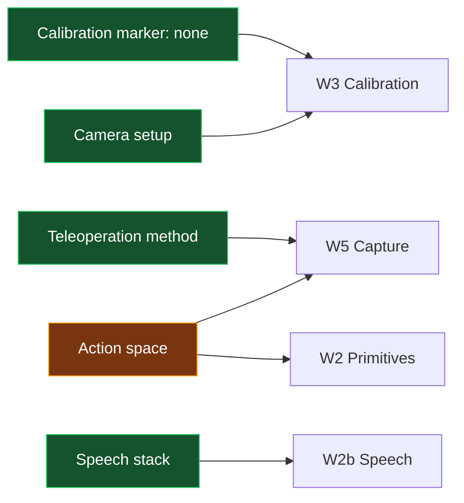

# Flowchart

Switch to reading view (Ctrl+E) to see these render. Mermaid is built into Obsidian, so nothing needs installing.

The graph view cannot show this. It is force directed and undirected, so it shows *that* two notes are linked but never which way the dependency runs. That is what these are for.

## Critical path

Everything that has to happen in order, and what can be done in parallel while waiting for the lab.

Red is the critical path. Amber is the thing blocking it. Green is in progress.

The shape of the risk is visible here: **four of the five red boxes sit downstream of one amber box.** Nothing you do in W1 or W2b changes that, which is why chasing lab access matters more this week than any code.

## Runtime, both architectures

What actually happens when you speak a command. Shared parts are the point: if these diverge, the comparison measures plumbing instead of architectures.

Blue is shared by both. Note that **Architecture B has no path back to the user**: there is no arrow returning from B to the microphone, and that missing arrow is the entire [[Tier 2 Ambiguity]] result.

## Decisions and what they block

One decision is still open. [[Action Space]] has to be settled before a single episode is recorded, because it must match what the primitives command.

[[Calibration Marker]] closed on 12 Aug with no marker, so W3 is now gated on lab access alone.

## Keeping these current

These are hand written, so they go stale if the plan changes and nobody updates them. Worth one minute after any scope change. The source of truth stays [[Schedule]] and `docs/fyp_plan.md`.

## Other ways to draw things in Obsidian

* **Canvas** is a core plugin and already enabled: right click in the file explorer, New canvas, then drag notes in as live cards and draw arrows between them. Better than Mermaid when you want to rearrange by hand, worse when you want it version controlled and diffable
* **Excalidraw** is a community plugin for sketching, useful for figures in [[D4 Final Report]]
* **Juggl** is a community plugin that replaces the graph view with one supporting directed layouts, if you specifically want the *whole vault* laid out rather than a curated diagram
